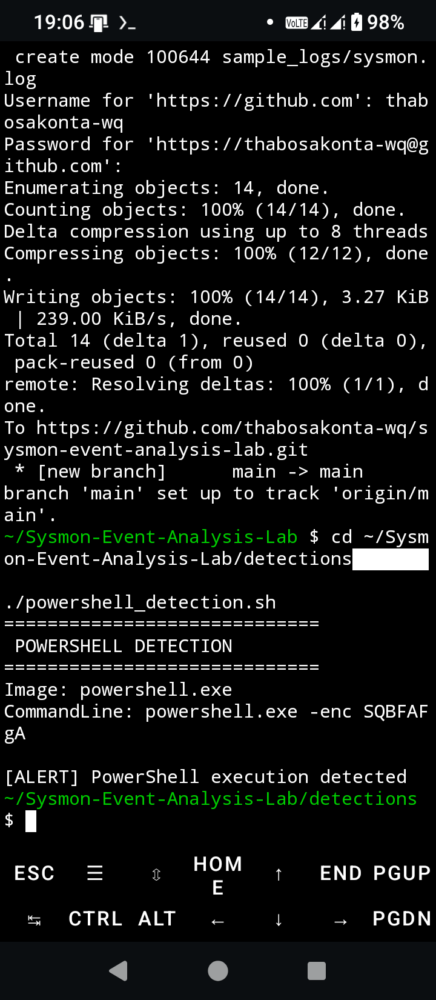
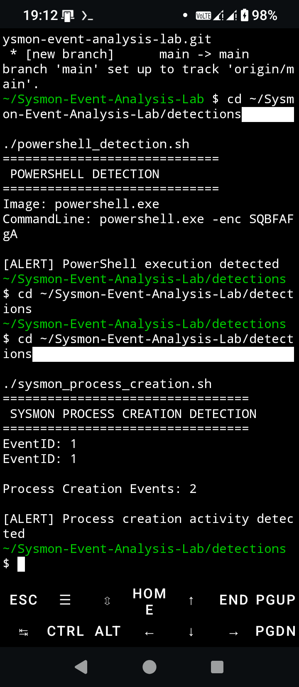
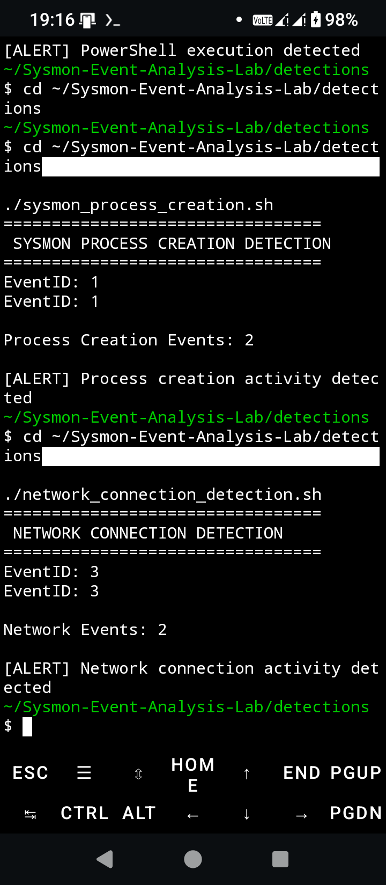

# Sysmon Event Analysis Lab

A cybersecurity detection engineering project focused on analyzing Sysmon events and developing detection logic for common attacker behaviors.

## Overview

This lab demonstrates how Security Operations Center (SOC) analysts investigate Sysmon telemetry to identify suspicious activity, correlate events, and document findings.

## Detection Capabilities

### Process Creation Detection

* Detects Sysmon Event ID 1
* Identifies process execution activity
* Supports threat hunting investigations

### PowerShell Detection

* Detects PowerShell execution events
* Highlights potentially suspicious command execution
* Supports malware and attacker activity investigations

### Network Connection Detection

* Detects Sysmon Event ID 3
* Identifies outbound and inbound network activity
* Supports command-and-control and lateral movement analysis

## Technologies Used

* Sysmon
* Bash
* Linux
* Termux
* MITRE ATT&CK
* Git
* GitHub

## MITRE ATT&CK Mapping

| Detection            | Technique |
| -------------------- | --------- |
| PowerShell Execution | T1059.001 |
| Network Connections  | T1071     |
| Process Creation     | T1059     |

## Learning Outcomes

* Sysmon Event Analysis
* Detection Engineering
* Threat Hunting
* Security Monitoring
* Incident Investigation
* MITRE ATT&CK Mapping
* SOC Operations

## Project Structure

```text
Sysmon-Event-Analysis-Lab
├── detections
├── events
├── reports
├── sample_logs
└── screenshots
```

## Future Enhancements

* Sigma Rule Mapping
* Wazuh Detection Rules
* Threat Intelligence Integration
* Automated Alert Correlation
* ATT&CK Navigator Mapping

## Screenshots

### PowerShell Detection



### Process Creation Detection



### Network Connection Detection



## Author

Thabo Sakonta

Microsoft Certified Security Operations Analyst (SC-200)

GitHub: https://github.com/thabosakonta-wq

LinkedIn: https://www.linkedin.com/in/thabo-sakonta-377a3748

License

This project is provided for educational and portfolio purposes.

